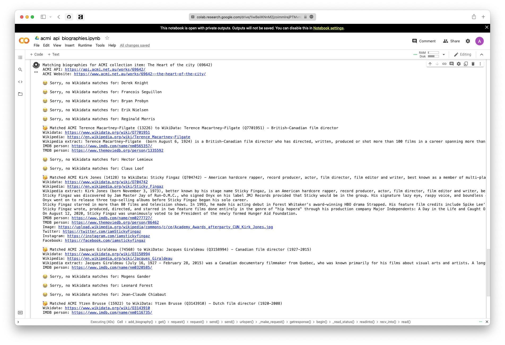

# ACMI API x internet biography metadata

ACMI Public API example matching internet biographies to Work creators.

## Wikidata and Wikipedia biography data

An example of matching Wikidata and Wikipedia biography data to ACMI collection creators.

### Jupyter Notebook

The Jupyter Notebook code to run this example on [Google Colab](https://colab.research.google.com) can be found in in the file `acmi_api_biographies.ipynb`.

Run it in Google Colab: [![Open In Colab][colab-badge]][colab-notebook]

[colab-notebook]: <https://colab.research.google.com/drive/1iwBeiIKNnM2jzoimmlrejPTMvnL28pXB>
[colab-badge]: <https://colab.research.google.com/assets/colab-badge.svg>

</img>

### Python

Run `python3 acmi_api_biographies.py` to first search the ACMI Works API for creators named `Simon`, and then search the Wikipedia API to get an extract of the biography of that person.

Example output:

```bash
$ python3 acmi_api_biographies.py

Found 20 ACMI works made by a creator with simon in their name.

Matching biographies for ACMI collection item: Noise TV - Darebin Music Feast (108853)
ACMI API: https://api.acmi.net.au/works/108853/
ACMI Website: https://www.acmi.net.au/works/108853--noise-tv-darebin-music-feast/

🥳 Matched ACMI Simon Moore (8931) to WikiData: Simon Moore (Q7519378) - British screenwriter
Wikidata: https://www.wikidata.org/wiki/Q7519378
Wikipedia: https://en.wikipedia.org/wiki/Simon_Moore_(writer)
Wikipedia extract: Simon Moore is a British screenwriter, director, and playwright. He is best known as writer for the 1989 six-part BBC miniseries about the international illegal drug trade, Traffik, the basis for the 2000 American crime film Traffic and the 2004 three-part USA network miniseries by the same name.
IMDB person: https://www.imdb.com/name/nm0601881/
TMDB person: https://www.themoviedb.org/person/21705
Image: https://upload.wikimedia.org/wikipedia/commons/f/fd/Simon_Moore.jpg

Matching biographies for ACMI collection item: Turangawaewae (108601)
ACMI API: https://api.acmi.net.au/works/108601/
ACMI Website: https://www.acmi.net.au/works/108601--turangawaewae/

😭 Sorry, no Wikidata matches for: Simon Price

...
```
